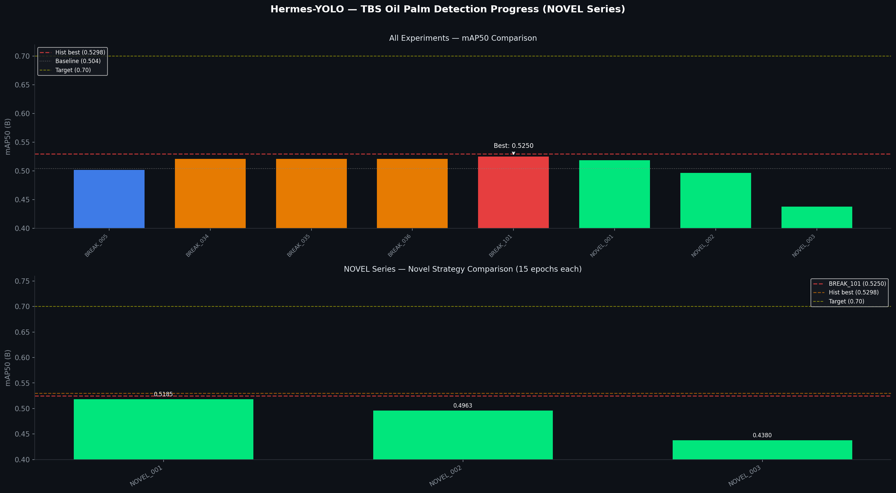

# Hermes-YOLO

> Autonomous hyperparameter & strategy search for TBS (Tandan Buah Segar) oil palm ripeness detection using YOLO.  
> Inspired by [Andrej Karpathy's autoresearch](https://github.com/karpathy/autoresearch).

---

## Problem

Detect 4 ripeness classes of oil palm fresh fruit bunches (TBS):

| Class | Color / Shape | Biological Position | Maturity |
|:-----:|:-------------|:--------------------|:---------|
| **B1** | Merah, besar, **bulat**, posisi **paling bawah** tandan | Outermost fruitlets | **Paling matang (Ripe)** |
| **B2** | Hitam → transisi merah, besar, bulat, di atas B1 | Mid-outer fruitlets | **Transisi (Semi-ripe)** |
| **B3** | Full hitam, **berduri**, **lonjong**, di atas B2 | Mid-inner fruitlets | **Belum matang (Unripe)** |
| **B4** | Terkecil, **terdalam** dalam tandan, duri banyak, hitam → hijau | Innermost fruitlets | **Paling belum matang (Least ripe)** |

**Ordinal biological ordering**: B1 → B2 → B3 → B4 = most ripe → least ripe

**Core challenges**:
- **B2/B3 confusion** — adjacent in the ripening sequence, visually similar color/texture at class boundary; misclassification by 1 step is biologically acceptable
- **B1/B4 rare classes** — B1/B4 are underrepresented in the dataset; B4 fruitlets are very small and deeply embedded
- **B1↔B4 errors are costly** — skipping 3 ordinal steps; should be penalized more heavily than B2↔B3

> Color physics insight: the CIE L\*a\*b\* **a\* channel** (green–red axis) physically separates B1 (a\* strongly positive, red) from B3 (a\* near zero, black) from B4 (a\* negative, green-tinted), providing a natural discriminative feature.

---

## Results



| Metric | Value |
|:-------|:------|
| Baseline mAP50 | 0.504 (STRUCT_000) |
| **Current Best (single model)** | **0.5316** (NOVEL_022, extended 60-epoch @ 768px) |
| **Historical Best (ensemble)** | **0.5298** (BREAK_037, Top-5 Ensemble) |
| Total experiments | **153+** (131 BREAK + 22 NOVEL) |
| Improvement over baseline | **+5.5%** |
| Target | > 0.70 |
| SOTA reference | 0.842 (Mansour 2022) |

See [LEADERBOARD.md](LEADERBOARD.md) for full rankings.

---

## NOVEL Series — Top Results

| Rank | Experiment | mAP50 | Strategy | Epochs |
|:----:|:-----------|:-----:|:---------|:------:|
| 1 | **NOVEL_022** | **0.5316** | Extended Training 60-epoch @ 768px | 60 |
| 2 | NOVEL_021 | 0.5269 | 768px + Label Smoothing 0.15 | 20 |
| 3 | NOVEL_013 | 0.5252 | Pseudo-label SSOD (Efficient Teacher proxy) | 14 |
| 4 | NOVEL_020 | 0.5250 | 768px + SORD σ=0.5 combo | 19 |
| 5 | NOVEL_005 | 0.5219 | Higher Resolution 768px | 15 |
| 6 | NOVEL_001 | 0.5185 | Label Smoothing 0.15 + CosLR | 15 |
| 7 | NOVEL_011 | 0.5185 | Three-Phase Curriculum (0.30→0.15→0.00) | 15 |
| 8 | NOVEL_015 | 0.5197 | Strong Aug Warmup / SimCLR proxy | 18 |
| 9 | NOVEL_016 | 0.5021 | Co-Teaching for Noisy Labels | 10 |
| 10 | NOVEL_010 | 0.5076 | SORD σ=0.5 (tighter ordinal) | 15 |

---

## Key Findings

**What works:**

| Strategy | Best mAP50 | Notes |
|:---------|:----------:|:------|
| Extended training (60 epochs, 768px) | 0.5316 | New best — NOVEL_022 |
| Top-K Ensemble | 0.5298 | Historical best (BREAK_037) |
| Pseudo-label SSOD | 0.5252 | NOVEL_005 as teacher, conf>0.5 pseudo-labels |
| 768px + Label Smoothing | 0.5269 | Best combo |
| Higher resolution (768px) | 0.5219 | Single strongest individual change |
| Label Smoothing 0.15 + CosLR | 0.5185 | Simple, effective ordinal proxy |
| Three-Phase Curriculum | 0.5185 | Smooth label schedule (0.30→0.15→0.00) |

**What doesn't work / lessons learned:**

| Strategy | Result | Lesson |
|:---------|:------:|:-------|
| Test-Time Augmentation (TTA) | 0.504 | No gain for this dataset |
| Architecture swap alone | 0.495 | Dataset quality is the constraint, not model capacity |
| Full combo all-at-once (NOVEL_009) | 0.325 | Too many simultaneous changes; each needs more epochs |
| KD Born Again Networks (15 epochs) | 0.349 | Teacher soft matrix approach needs longer training |
| EDL (Evidential Deep Learning) | 0.104 | High recall but near-zero precision — Dirichlet loss destabilizes YOLO detection head |
| P2 Head at 15 epochs | 0.438 | Adds complexity; needs 50+ epochs to converge |

---

## Experiment Tiers (NOVEL Series)

| Tier | Focus | Experiments | Status |
|:-----|:------|:-----------|:-------|
| **TIER 1** | Zero inference cost, training-only | NOVEL_001–010 | ✅ All done |
| **TIER 2** | High ROI, low-medium effort | NOVEL_011–014 | ✅ Done (012 rerunning) |
| **TIER 3** | Strong potential, medium effort | NOVEL_015–016 | ✅ Done |
| **TIER 4** | Uncertainty quantification | NOVEL_017 | ✅ Done |
| **TIER 5** | Experimental | NOVEL_018–019 | 🔄 Rerunning after bug fixes |
| **Combos** | Best strategies combined | NOVEL_020–022 | ✅ Done |

See [IDEA.md](IDEA.md) for full strategy descriptions and per-experiment analysis.

---

## Repository Structure

```
Hermes-YOLO/
├── novel_runner.py              # NOVEL series runner (TIER 1-5, all 22 experiments)
├── autoresearch.py              # Legacy autonomous research orchestrator
├── batch_runner.py              # Legacy batch experiment runner
├── dataset_novel.yaml           # Dataset config (RGB, 2764 train / 604 val / 624 test)
├── dataset_novel_lab.yaml       # Dataset config (L*a*b* color space variant)
├── IDEA.md                      # Strategy tracker — all TIER 1-5 ideas + results
├── LEADERBOARD.md               # Full experiment rankings
├── experiments/
│   └── visualizations/          # progress_map50.png — auto-updated after each run
├── runs/detect/experiments/
│   └── experiments/runs/
│       └── NOVEL_*/             # Per-experiment weights, results.csv, args.yaml
└── dataset_pseudo/              # Auto-generated pseudo-labeled dataset (NOVEL_013)
```

---

## Quick Start

```bash
pip install -r requirements.txt

# Run all NOVEL experiments (TIER 1-5), sequentially
python novel_runner.py

# Legacy: run BREAK series experiments
python autoresearch.py

# Generate visualization charts
python generate_charts.py
```

---

## Dataset

- **4 classes**: B1 (ripe), B2 (transitioning), B3 (unripe), B4 (least ripe)
- **Split**: 2,764 train / 604 val / 624 test images
- **Sources**: DAMIMAS + LONSUM oil palm plantations
- **Class imbalance**: B1/B4 underrepresented; B2/B3 dominant
- **L\*a\*b\* variant**: pre-converted dataset for color-space experiments (NOVEL_002)

---

## Reproducibility

All experiments use `seed=42`.

```bash
# Check a specific experiment config
cat runs/detect/experiments/experiments/runs/NOVEL_022/args.yaml

# Re-run the best single-model experiment
python -c "
from novel_runner import EXPERIMENTS, run_experiment
cfg = next(e for e in EXPERIMENTS if e['id'] == 'NOVEL_022')
run_experiment(cfg)
"
```

---

## References

- Díaz & Marathe, *Soft Labels for Ordinal Regression* (CVPR 2019) — SORD loss
- Furlanello et al., *Born Again Networks* (ICML 2018) — Knowledge Distillation
- Han et al., *Co-Teaching* (NeurIPS 2018) — Noisy label training
- Sensoy et al., *Evidential Deep Learning* (NeurIPS 2018) — EDL uncertainty
- Lin et al., *Focal Loss* (ICCV 2017) — Hard-example mining
- Mansour et al., 2022 — SOTA 0.842 mAP on TBS detection
- Septiarini et al., 2021 — L\*a\*b\* color for oil palm ripeness (98.3% accuracy)
